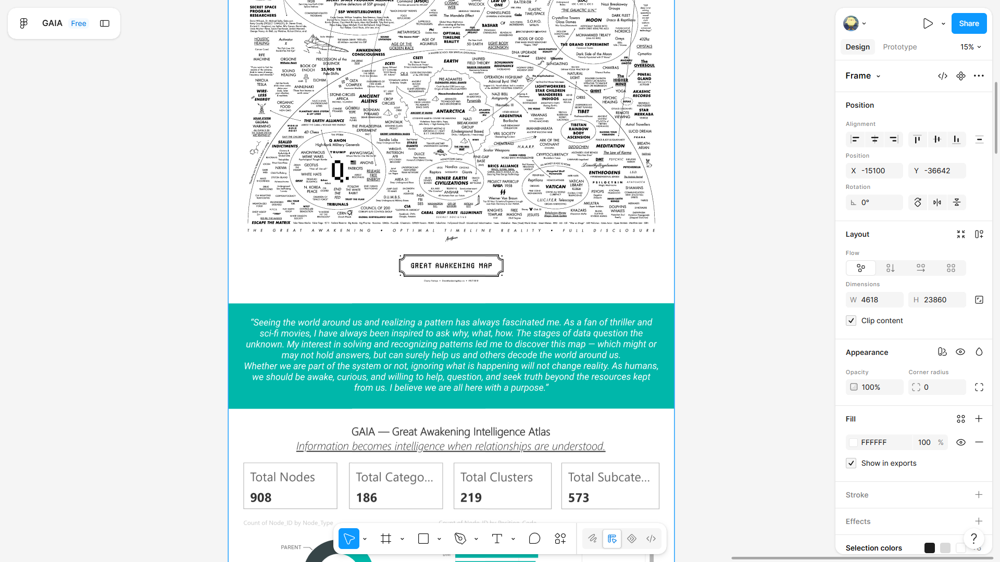
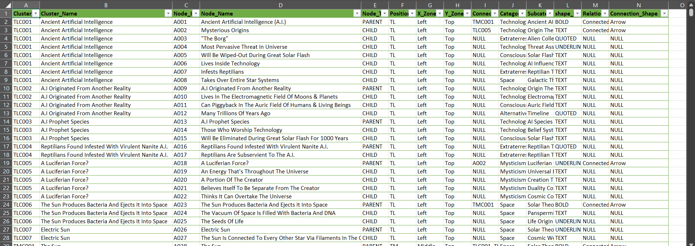
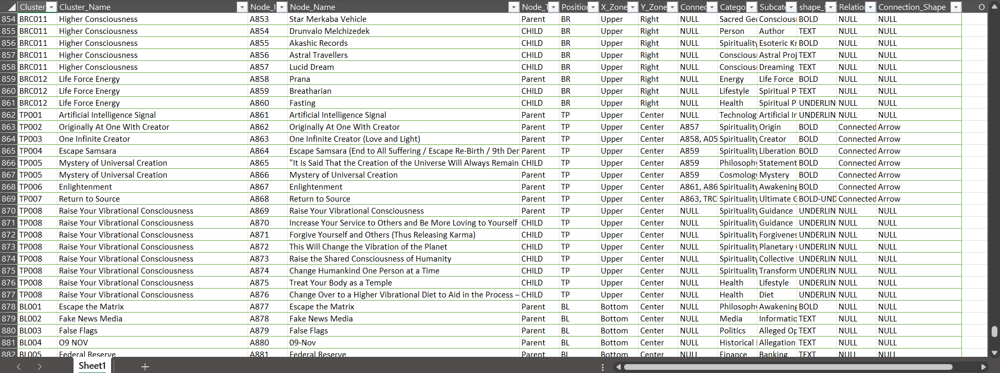
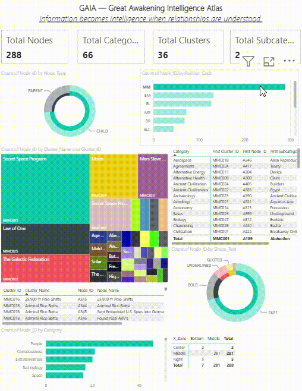
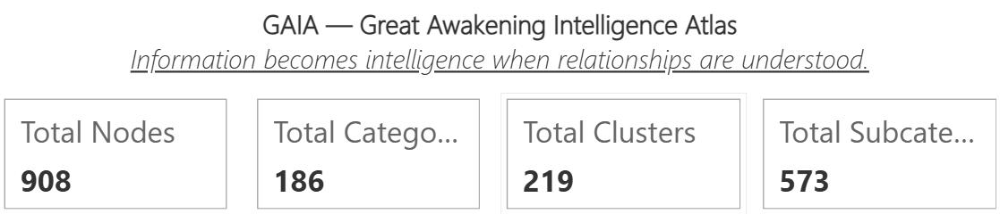
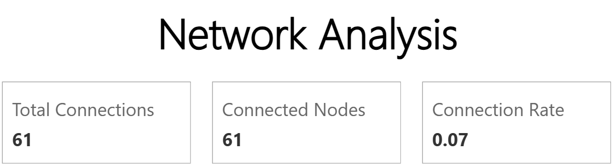

# GAIA – Great Awakening Intelligence Atlas

**Live Website:** [Click here to access the website](https://gaiacp.netlify.app/)

## Overview

The **Great Awakening Intelligence Atlas (GAIA)** is a data visualization and knowledge organization project that transforms the original Great Awakening Map into a structured, searchable dataset. The project involved manually extracting information from the map, organizing it into a relational Excel dataset, and developing an interactive Power BI dashboard to analyze nodes, clusters, categories, and relationships. Rather than presenting the map as a static infographic, the project converts it into a navigable knowledge base for exploration and pattern analysis.

---

## Project Objectives

The primary objective of this project was to convert an unstructured visual map into a structured dataset that could be explored through interactive analytics. The project focused on building a consistent data model while learning modern business intelligence techniques.

* Transform a complex infographic into structured data.
* Create a searchable knowledge graph.
* Organize concepts into clusters and hierarchical relationships.
* Build an interactive dashboard using Power BI.
* Perform basic network and relationship analysis.

---

## Dataset Preparation

The dataset was created entirely through manual extraction and organization of information from the original map. Every topic, concept, and relationship was assigned unique identifiers and categorized to create a structured relational dataset suitable for visualization and analysis.

The final dataset includes:

* Cluster IDs and Cluster Names
* Node IDs and Node Names
* Parent and Child relationships
* Categories and Subcategories
* Position and Layout information
* Relationship metadata

---

## Dashboard Development

The structured Excel dataset was imported into Microsoft Power BI to create an interactive dashboard. Multiple visualizations were developed to summarize the dataset and allow users to explore clusters, categories, and network relationships through filters and cross-interactions.

The dashboard includes:

* Dataset summary statistics
* Category distribution
* Cluster distribution
* Parent and Child node analysis
* Network connection statistics
* Interactive filtering and slicing
* Relationship tables
* Dynamic drill-down exploration

---

## Screenshots

The following screenshots demonstrate different stages of the project, from data preparation to interactive visualization.

### Website Preview
The website was first designed in Figma before development.

## Sample Excel Dataset

The following screenshots show a portion of the manually structured dataset used to build the Power BI dashboard.

---

## Dashboard Demonstration

A short demonstration showcasing the interactive features of the Power BI dashboard, including filtering, cross-highlighting, and navigation.

  

---

## Tools and Technologies

The project combines spreadsheet-based data preparation with business intelligence tools for visualization.

* Microsoft Excel
* Microsoft Power BI
* Power Query
* DAX
* GitHub

---

## Dataset Summary

---

## Learning Experience

This project marked my first experience using Microsoft Power BI. Coming from a background of working primarily with Microsoft Excel, it provided an opportunity to understand how business intelligence platforms extend traditional spreadsheet analysis. While Excel is effective for data organization, calculations, and static reporting, Power BI introduces interactive visualizations, data modeling, cross-filtering, dynamic dashboards, and drill-down analysis. Working on this project helped me understand the advantages of transforming structured datasets into interactive analytical reports that make complex information easier to explore and interpret.

---

## Acknowledgement

This project was developed as a data organization and visualization exercise using the Great Awakening Map as the source material. The focus of the project is on demonstrating data extraction, data modeling, and interactive visualization techniques. The project does not endorse or validate the claims represented in the original source material.
